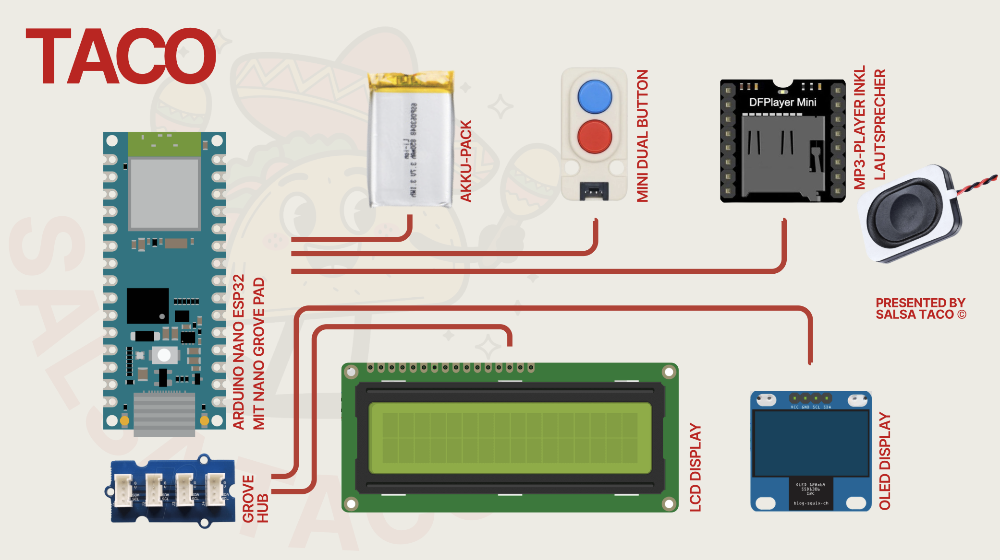

# SALSA TACO
Der **SALSA TACO** ist ein sprechender Tanzlehrer in Form eines Tacos.
Er ermöglicht, spielerisch Tanzschritte mittels einer Fussmatte und konkreten Anweisungen zu erlernen und mit passender Musik zu praktizieren.

## Konzept
### Detaillierte Spielbeschreibung
Der **SALSA TACO** ist ein interaktiver, sprechender Tanzlehrer, der dich durch verschiedene Tanzschritte führt. Das System besteht aus zwei Hauptkomponenten:
1. **Der Taco**, ein sprechender Assistent mit Display, Knöpfen und Lautsprecher.
2. **Das Board**, eine Fussmatte mit fünf Distanzsensoren, die deine Schritte erkennt.
   
Das Spiel hat zwei Modi: **Lernmodus** und **Freestyle**.

#### Lernmodus
Im Lernmodus wirst du vom Taco durch eine Reihe vorgegebener Schritte geführt, die auf dem Display sichtbar gemacht werden. Hier lernst du Salsa zu tanzen!

**So funktioniert’s:**
1.	**Start**  
   Du drückst den blauen Knopf, um den Lernmodus zu aktivieren.
   Der Taco begrüsst dich und erklärt kurz, was zu tun ist.
3. **Positionieren**  
   Du stellst dich auf das Board.
   Die Distanzsensoren prüfen, ob du bereitstehst.
4. **Startsignal**  
   Drückst du erneut den blan Knopf, startet Level 1.
   Gleichzeitig zeigt das Display die Felder an, auf die du drauftreten musst.
5. **Schritterkennung**  
   Jeder Sensor des Boards entspricht einem Feld: vorne, hinten, links, rechts, Mitte.
   Trittst du auf das richtige Feld, erkennt der Distanzsensor deine Bewegung.
6. **Timing**  
   Jedes Level hat ein kleines Zeitfenster, in dem der richtige Schritt gemacht werden muss (5 Sekunden).
   Ein Schritt zählt nur, wenn Sensor + Zeit stimmen.

**Levelsystem:**
Es gibt 5 Levels, die sich in Schwierigkeit unterscheiden.
   
**Fehler und Neustart:**
- Machst du die richtigen Schritte eines Levels, gibt es ein Level Up.
- Machst du einen Fehler, hast du das Spiel verloren und fängst wieder
  bei Level 1 an.
  

#### Freestyle 
Der Freestyle-Modus erlaubt freies Tanzen, ohne Bewertung oder Levelstruktur. Hier kannst du deine gelernten Salsa-Skills zeigen!

**So funktioniert’s:**
1.	Drücke den roten Knopf.
2.	Stelle dich auf das Board.
3.	Wenn du bereit bist zu tanzen, drücke den roten Knopf erneut.
4.	Der Taco spielt Musik ab und du kannst dich frei bewegen.

### Musik
In beiden Modi spielt der DFPlayer passende Salsa-Musik ab:
- Im Lernmodus ändert sich die Musik pro Level
- Im Freestyle läuft die Musik zufällig.

## Anforderungen
Um dieses Projekt nachzubauen, benötigst du:

### Hardware 
**Taco:** 
* [Ein Arduino Nano ESP32](https://store.arduino.cc/products/nano-esp32-with-headers)
* Ein Dual Button Unit 
* Ein Grove LCD Display 16x2 
* Ein OLED Display SH1106 
* Ein DFPlayer Mini MP3 Player inkl. Lautsprecher
* Ein Battery Pack 
* Ein Grove hub 

**Board:** 
* [Ein Arduino Nano ESP32](https://store.arduino.cc/products/nano-esp32-with-headers) 
* 5 Modulino Distanzsensoren
* Ein USB-C Kabel 
* Eine USB-C Powerbank

### Software
* [MicroPython](https://micropython.org/)
* [Arduino Lab for MicroPython](https://labs.arduino.cc/en/labs/micropython)
* [Arduino MicroPython Installer](https://labs.arduino.cc/en/labs/micropython-installer)

### Bibliotheken
* [MicroPython I2C 16x2 LCD driver](https://github.com/ubidefeo/micropython-i2c-lcd)
* [sh1106 OLED Library](https://github.com/robert-hh/SH1106/)
* [DFPlayer Mini Library für MicroPython](https://github.com/sebromero/micropython-dfplayer)
* [Modulino Distance](https://github.com/arduino/arduino-modulino-mpy/blob/main/docs/api.md#modulino.distance.ModulinoDistance)

## Aufbau / Installation

### Verkabelung

### Code hochladen
Im **src**-Ordner befinden sich zwei Unterordner:
- **taco:** Dieser Code wird ausschließlich auf den Arduino des Tacos hochgeladen.
   - `Taco.py` ist das Hauptprogramm des Tacos.
   - `StepManager.py` und `espnow_manager.py` sind zusätzliche Bibliotheken, die ebenfalls benötigt werden.
- **board:** Dieser Code wird ausschließlich auf den Arduino des Boards hochgeladen.
   - `Board.py` ist das Hauptprogramm des Boards.
   - `StepManager.py` und `espnow_manager.py` sind zusätzliche Bibliotheken, die ebenfalls benötigt werden.

Stelle sicher, dass die oben aufgeführten Bibliotheken auf dem jeweiligen Arduino installiert sind.

### Feedback und Fragen
Wenn du dich für dieses Projekt interessierst oder Fragen hast, kannst du gerne über Instagram, TikTok oder andere Kanäle mit uns Kontakt aufnehmen.
